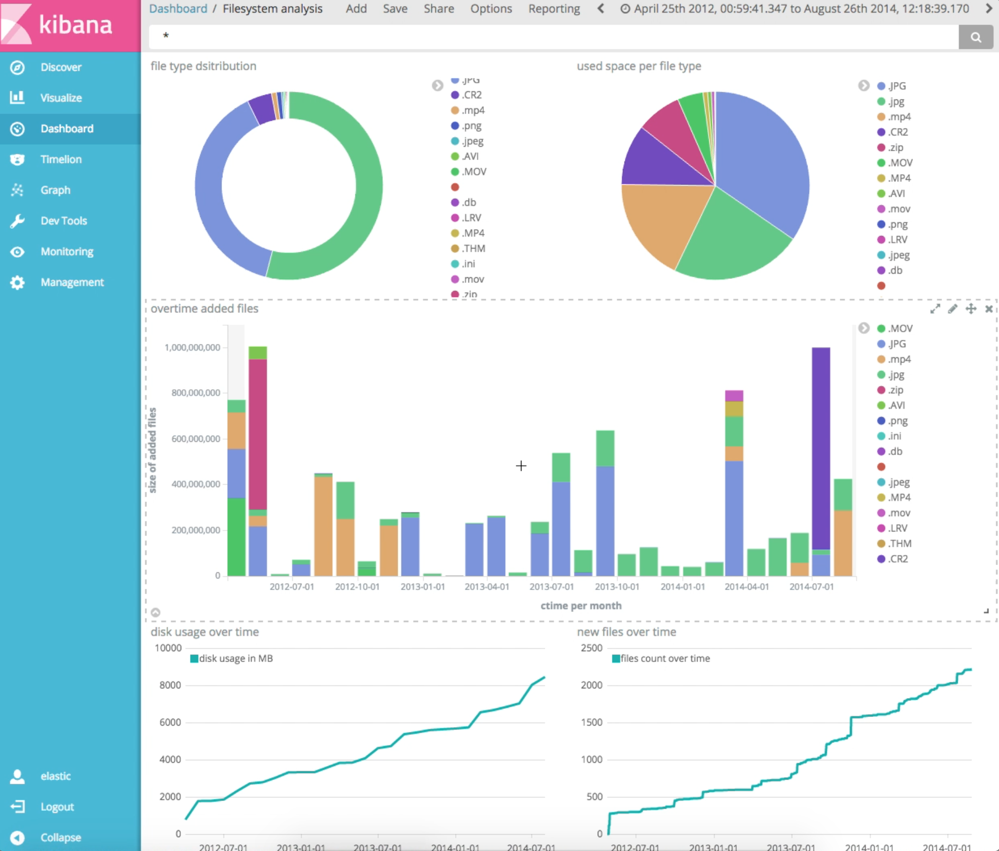
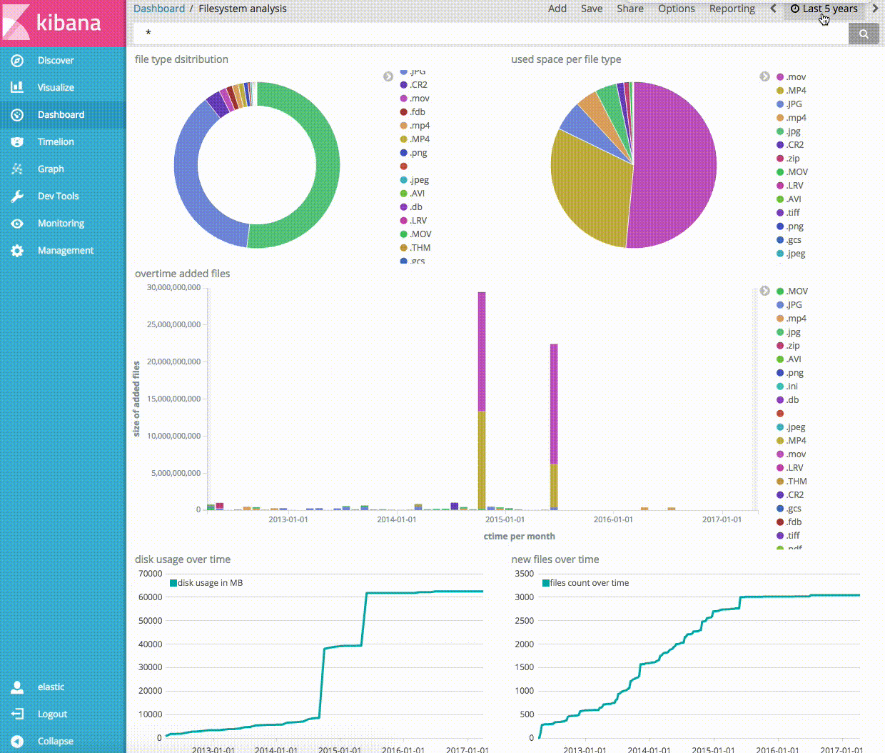

# File system analysis with Elasticsearch and Kibana

## Motivation
When moving from a filesystem based to a dms like alfresco it´s important to know how many files were added over time. Additionally it would be good to filter by some special file type (no media files, only office files for example).

This repo contains different scripts and settings for an elk stack used as an dynamic file system analysis tool.



## Quick start

- check out this repo
```
git clone
cd elk-filesystem-analysis
```
- start elk stack with docker-compose
```
docker-compose up
```
- prepare index with bash script
```
cd index
./prepare_index.sh
```
- import kibana settings containing dashboard and visualization settings
- open kibana and set default index to fsanalyzer with ctime as default time field
- use python script to index a directory
```
python3.6 filestructure-elastic-loader.py /path/to/index
```
- visit kibana dashboard http://localhost:5601

## Description
The python script walks through the given directory recursively. For each file in the directory the script creates a json object which is sent to elasticsearch.

```
{
  'name': 'filename01.jpg',
  'fullpath': '/path/to/index/pictures/xmas2016/filename01.jpg',
  'filesize': 3400000
  'suffix': '.jpg',
  'ctime': '2017-04-12T10:36:55'
}
```

### Features
- trace file size usage (over time)
- trace file count (over time)
- filter by filetype
- filter by directory
- filter by specific time intervals


